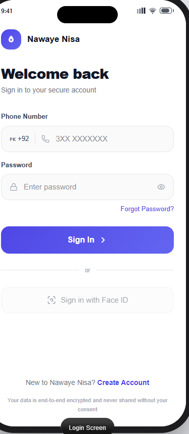
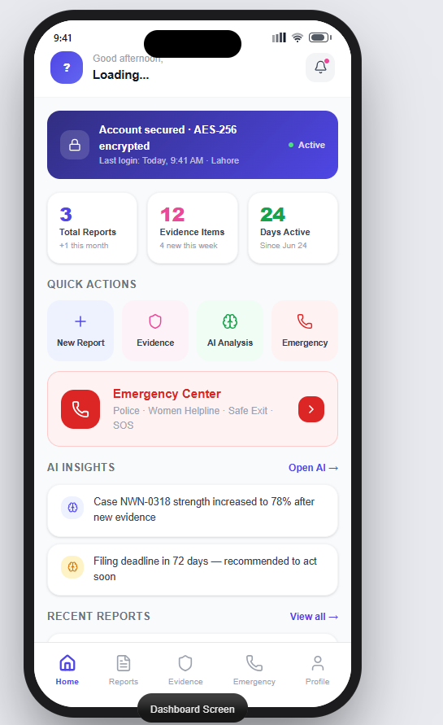
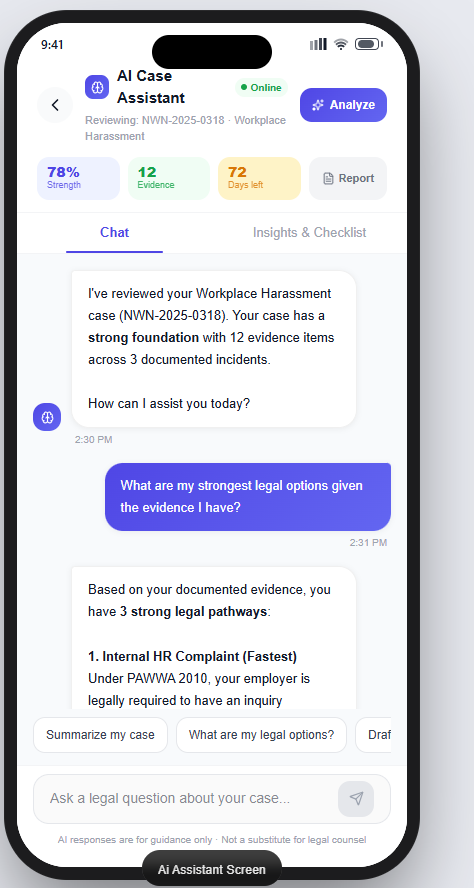
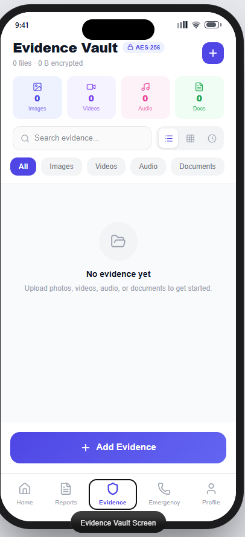
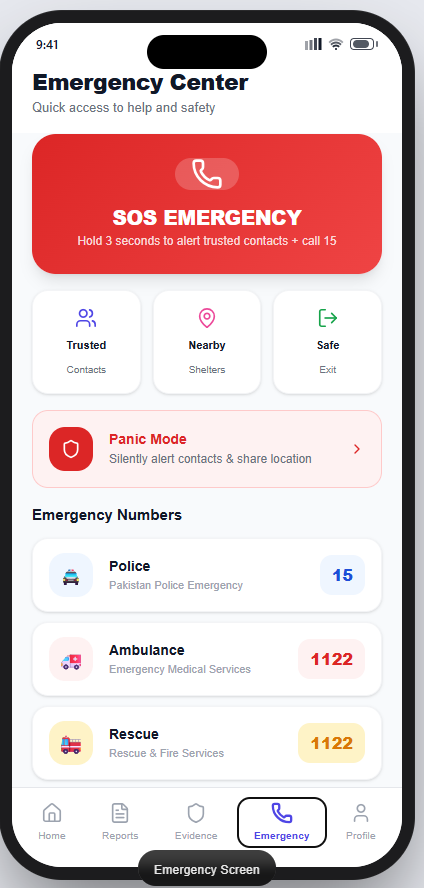

<div align="center">

# 🛡️ Nawaye Nisa

### Pakistan's AI-Powered Survivor Support Platform for Women

**Empowering survivors. Preserving evidence. Enabling justice.**

</div>

<p align="center">
  
  
  
  
</p>

<p align="center">
 🌐 Live Website: https://nawaye-nisa.vercel.app 🌐 Live Demo</a> •
  <a href="../../issues">🐛 Report Bug</a> •
  <a href="../../issues">💡 Request Feature</a>
</p>


📖 Table of Contents


Project Overview
Problem Statement
Our Solution
Live Demo
Screenshots
Features
AI Feature
Tech Stack
Architecture
Folder Structure
Installation
Environment Variables
Deployment
Privacy & Security
Challenges Faced
Future Improvements
Testing
Why This Project Matters
Author


🌍 Project Overview


Nawaye Nisa ("Voice of Women") is a survivor-centered digital platform built to help women in Pakistan document, report, and respond to incidents of harassment, violence, and abuse — safely, privately, and with the support of AI.
Why This App Exists
Every year, thousands of incidents involving harassment, domestic violence, stalking, and cyber-based abuse go unreported in Pakistan. Survivors often face a fragmented, intimidating, and emotionally exhausting process when they try to seek help — one that requires navigating unfamiliar legal language, recalling traumatic details under pressure, and worrying about who will see their information. Nawaye Nisa was built to remove those barriers, one at a time.
What Problem It Solves
The platform gives survivors a single, secure space to:
Document incidents as they happen, with dates, locations, and evidence preserved in order
Understand their legal rights in plain, accessible language
Generate a structured complaint draft without needing legal training
Reach trusted contacts or nearby help instantly during an emergency
Keep a private, tamper-resistant record of everything that happened
Who It Helps
Nawaye Nisa is designed for survivors of domestic violence, workplace harassment, stalking, blackmail, and online abuse across Pakistan — as well as the trusted friends, family members, and legal advocates who support them.
Why Pakistan Needs This Solution
Legal literacy, privacy concerns, and social stigma often keep survivors from coming forward. A locally-relevant platform — one that understands Pakistan's provinces, districts, and legal framework — closes the gap between "wanting help" and "getting help."
Why AI Improves the Process
Recalling and structuring traumatic events is difficult, especially under stress. AI assistance helps survivors organize scattered memories into a clear, chronological account, draft a complaint in appropriate legal language, and do so without ever feeling judged or rushed.


⚠️ Problem Statement


Challenge	Description
Domestic Violence	Survivors frequently lack a private, safe way to document repeated incidents over time.
Harassment	Workplace and public harassment often goes unreported due to fear of retaliation or disbelief.
Cybercrime	Online abuse, impersonation, and image-based exploitation are rising and under-addressed.
Stalking	Patterns of stalking are hard to prove without a consistent, timestamped record.
Blackmail	Victims often don't know how to safely preserve threatening messages as evidence.
Loss of Evidence	Screenshots, messages, and photos are frequently lost, deleted, or disorganized.
Delayed Reporting	Survivors often wait too long to report, weakening their case and delaying protection.
Lack of Legal Awareness	Most survivors do not know their rights or the correct reporting procedure.
Emotional Barriers	Fear, shame, and trauma make it difficult to speak about incidents, even to authorities.
Privacy Concerns	Survivors fear their data being exposed to abusers, family, or the public.
Each of these barriers compounds the others — a survivor who fears for her privacy is less likely to report; one who lacks legal knowledge is less likely to preserve the right evidence. Nawaye Nisa was designed to address them together, not in isolation.


✅ Our Solution


Problem	How Nawaye Nisa Solves It
Domestic Violence	Chronological incident timeline that builds a verifiable history over time
Harassment	Structured incident reporting with categorization and severity tagging
Cybercrime	Evidence Vault for secure storage of screenshots, messages, and media
Stalking	Timeline view reveals patterns across dates and locations
Blackmail	Evidence upload preserves original files with metadata intact
Loss of Evidence	Centralized, encrypted Evidence Vault backed by Firebase Storage
Delayed Reporting	AI Assistant lowers the effort needed to start a report
Lack of Legal Awareness	Dedicated Legal Rights section in plain, accessible language
Emotional Barriers	Empathetic AI tone that never blames or pressures the survivor
Privacy Concerns	Firebase Authentication, strict Firestore rules, and private-by-default data


🚀 Live Demo

🌐 Live Website


https://nawaye-nisa.vercel.app/


📦 GitHub Repository


https://github.com/alishahkhan8848-ux/Nawaye-Nisa.git


# 📸 Screenshots

## 🔐 Login Screen



A clean, distraction-free login screen backed by Firebase Authentication for secure session management.

## 📊 Dashboard



The survivor's home base — a summary of recent reports, quick actions, and access to every core feature in one glance.

## 🤖 AI Assistant



A conversational interface where survivors describe events naturally, and the AI organizes them into a structured, factual account.

## 📂 Evidence Vault



A secure, encrypted repository where survivors can safely store screenshots, photos, audio recordings, videos, and important documents. All evidence is organized by incident, making it easy to retrieve, review, and use when preparing reports or seeking legal assistance.


## 🚨 Emergency Center



A dedicated emergency hub that provides one-tap access to trusted contacts, emergency helplines, and nearby support resources. In critical situations, survivors can quickly reach help and share their location to ensure a faster response.


✨ Features


Category	Feature	Description
Authentication	Secure Login	Firebase-backed login with session persistence
	Registration	Minimal-data sign-up with privacy-first defaults
AI	AI Assistant	Conversational incident documentation support
	Complaint Draft Generation	Auto-generates structured, legally-formatted drafts
Documentation	Incident Documentation	Structured, guided incident reporting forms
	Timeline	Chronological view of all incidents
Evidence	Evidence Upload	Secure upload for images, documents, and audio
	Evidence Vault	Encrypted, organized evidence storage
Data	Firestore Storage	Structured, queryable incident and user data
	Firebase Authentication	Identity and session management
Safety	Trusted Contacts	Emergency contact list with instant alerts
	Nearby Help	Location-based directory of help resources
	Emergency Support	One-tap emergency activation
Localization	Province Selector	Pakistan-specific province selection
	District Selector	Granular district-level location data
	Tehsil Selector	Fine-grained tehsil-level location data
	Language Support	Multi-language interface
Account	User Profiles	Personal information and preference management
	Notifications	Real-time in-app alerts
Resources	Safety Resources	Curated safety and awareness content
	Legal Rights	Plain-language legal information
Design	Responsive Design	Fully responsive across devices
	Modern UI	Clean, calming, professional interface
	Accessibility	Designed with accessibility best practices
	Privacy	Privacy-first architecture throughout
---


🤖 AI Feature


The AI Assistant is the emotional and functional core of Nawaye Nisa. It transforms a survivor's raw, often fragmented account of events into a clear, structured, and usable record.
How It Works
The survivor describes an incident in their own words, in a supportive chat interface.
The AI asks gentle, clarifying questions to fill in key details (date, location, people involved).
The AI extracts structured facts from the conversation — no legal knowledge required from the user.
The AI generates a complaint draft and a timeline entry, ready for review.
Input
Free-form natural language describing an incident, along with any uploaded evidence (screenshots, messages, images).
Output
A structured incident summary
A chronological timeline entry
A formatted complaint draft suitable for legal or police submission
Suggested next steps (e.g., nearby help, legal rights relevant to the incident)
Why It's Useful
Survivors rarely think in bullet points while processing trauma. The AI bridges the gap between "what happened to me" and "what a legal document needs to say," without requiring the survivor to have any legal expertise — and without ever making them feel rushed, judged, or disbelieved.
AI System Prompt
```


You are a supportive AI assistant for Nawaye Nisa, a survivor support platform.

Your responsibilities:
- Listen to the survivor's account with empathy and patience.
- Summarize incidents clearly and factually, using the survivor's own words wherever possible.
- Extract key facts: date, time, location, people involved, and nature of the incident.
- Generate a structured complaint draft suitable for legal or police submission.
- Never blame, judge, or question the survivor's account.
- Never minimize the severity of what is described.
- Remain calm, empathetic, and non-judgmental in every response.
- Never fabricate details, dates, or facts not provided by the user.
- If the user describes an immediate danger or life-threatening situation,
  gently but clearly encourage them to contact local emergency services
  or use the app's Emergency Mode.
- Protect the survivor's privacy: never repeat sensitive information
  outside the current conversation, and never encourage sharing details
  in unsafe channels.
- Use clear, plain language — avoid legal jargon unless explaining it.
- Always give the survivor full control over what is included in any
  generated document.
```
---


🛠️ Tech Stack


Layer	Technology
Frontend	React (TypeScript)
Backend	Firebase Cloud Functions(not fully functional because of upgrade)
Authentication	Firebase Authentication
Database	Cloud Firestore(not fully functional because of upgrade)
Storage	Firebase Storage(not fully functional because of upgrade)
Deployment	Vercel
Language	TypeScript
Version Control	Git & GitHub
AI	Large Language Model API
IDE	Visual Studio Code
Design Tool	Figma
---


🏗️ Architecture


```
                         ┌────────────────────┐
                        │        User         │
                        └─────────┬──────────┘
                                  │
                        ┌─────────▼─────────---─┐
                        │ React + Vite Frontend │
                        └─────────┬────────---──┘
                                  │
                 ┌────────────────▼────────────-────┐
                 │ Firebase Authentication ✅       │
                 │ (Implemented & Working)          │
                 └────────────────┬─────────────-───┘
                                  │
                 ┌────────────────▼────────────────┐
                 │ Firestore Database              │
                 │ (Schema Designed • Integration  │
                 │ Ready • Full Deployment Pending)│
                 └────────────────┬────────────────┘
                                  │
                 ┌────────────────▼────────────────┐
                 │ Firebase Storage                │
                 │ (Architecture Ready • Upload    │
                 │ Module Pending Firebase Upgrade)│
                 └────────────────┬────────────────┘
                                  │
                 ┌────────────────▼────────────────┐
                 │ AI Assistant                   │
                 │ (Prototype / Prompt Engine)    │
                 └────────────────┬────────────────┘
                                  │
                 ┌────────────────▼────────────────┐
                 │ AI Complaint Generator          │
                 │ (Draft Generation Ready)        │
                 └────────────────┬────────────────┘
                                  │
                 ┌────────────────▼────────────────┐
                 │ Evidence Timeline & Reports     │
                 │ (UI Completed • Backend Pending)│
                 └─────────────────────────────────┘
---


Implementation Status

✅ React + Vite Frontend Completed
✅ Firebase Authentication Integrated
✅ UI for Evidence Vault, AI Assistant, Emergency Center, and Profile Completed
🟡 Firestore Database schema designed; full cloud integration pending.
🟡 Firebase Storage integration prepared but requires Firebase plan upgrade for complete deployment.
🟡 AI-powered complaint generation is implemented as a prototype and will be enhanced in future releases.


📁 Folder Structure


```
nawaye-nisa/
├── public/
│   └── assets/
├── screenshots/
├── src/
│   ├── components/
│   │   ├── auth/
│   │   ├── dashboard/
│   │   ├── incident/
│   │   ├── ai-assistant/
│   │   ├── evidence-vault/
│   │   ├── timeline/
│   │   ├── emergency/
│   │   └── shared/
│   ├── pages/
│   │   ├── Login.tsx
│   │   ├── Register.tsx
│   │   ├── Dashboard.tsx
│   │   ├── IncidentReport.tsx
│   │   ├── AIAssistant.tsx
│   │   ├── EvidenceVault.tsx
│   │   ├── Timeline.tsx
│   │   ├── LegalRights.tsx
│   │   ├── NearbyHelp.tsx
│   │   └── Settings.tsx
│   ├── services/
│   │   ├── firebase.ts
│   │   ├── auth.service.ts
│   │   ├── firestore.service.ts
│   │   ├── storage.service.ts
│   │   └── ai.service.ts
│   ├── context/
│   ├── hooks/
│   ├── utils/
│   ├── types/
│   ├── App.tsx
│   └── main.tsx
├── .env.example
├── package.json
├── tsconfig.json
└── README.md
```
---


⚙️ Installation


Follow these steps to run Nawaye Nisa locally:
```bash
# 1. Clone the repository
git clone https://github.com/alishahkhan8848-ux/Nawaye-Nisa.git

# 2. Navigate into the project directory
cd nawaye-nisa

# 3. Install dependencies
npm install

# 4. Set up environment variables
cp .env.example .env
# Fill in your Firebase and AI API credentials

# 5. Run the development server
npm run dev
```
The app will be available at `http://localhost:5173` (or the port shown in your terminal).
---


🔐 Environment Variables


Nawaye Nisa requires a `.env` file for local development. Never commit your `.env` file or expose real credentials. Use `.env.example` as a reference template.
```env
VITE\_FIREBASE\_API\_KEY=
VITE\_FIREBASE\_AUTH\_DOMAIN=
VITE\_FIREBASE\_PROJECT\_ID=
VITE\_FIREBASE\_STORAGE\_BUCKET=
VITE\_FIREBASE\_MESSAGING\_SENDER\_ID=
VITE\_FIREBASE\_APP\_ID=
VITE\_AI\_API\_KEY=
```
Add `.env` to your `.gitignore` before your first commit to ensure secrets are never pushed to the repository.
---


☁️ Deployment


Nawaye Nisa is deployed using Vercel, connected directly to this GitHub repository.
Push changes to the `main` branch.
Vercel automatically detects the push via GitHub integration.
A production build is triggered and deployed within minutes.
Environment variables are configured securely in the Vercel dashboard, not in the codebase.
This setup ensures every merged change is reflected live with zero manual deployment steps.
---


🔒 Privacy & Security


Security is not an afterthought in Nawaye Nisa — it is a foundational design principle.
Authentication: All access is gated behind Firebase Authentication; no data is accessible without a verified session.
Firestore Rules: Strict, per-user security rules ensure a survivor's data is only ever readable by that survivor.
Storage Rules: Evidence files are scoped to the uploading user and inaccessible to any other account.
Environment Variables: All API keys and secrets are stored in environment variables, never hardcoded or committed.
Sensitive Data: Personally identifying information is minimized wherever possible.
Evidence Protection: Uploaded evidence is stored with restricted access rules and is never publicly listable.
---


🧗 Challenges Faced


Building Nawaye Nisa came with real engineering hurdles:
Firebase Integration: Structuring Firestore collections to support nested incident and evidence data cleanly.
Authentication: Handling edge cases in session persistence and token refresh across page reloads.
Evidence Storage: Designing a storage schema that keeps large media files organized and access-controlled per user.
Responsive UI: Ensuring the interface remains calm and usable across a wide range of device sizes.
Deployment: Managing environment variable parity between local development and Vercel production.
Git: Coordinating a clean commit history while iterating quickly on UI and logic changes.
Vercel: Resolving build-time environment variable mismatches during initial deployment setup.
AI Prompt Engineering: Iterating on the system prompt to ensure consistent empathy, factual accuracy, and zero victim-blaming language across varied incident descriptions.
---


🔮 Future Improvements


Offline-first support for low-connectivity areas
Integration with official police complaint portals
Voice-to-text incident reporting for accessibility
End-to-end encryption for evidence uploads
Multi-survivor case linking for repeat offenders
Direct integration with legal aid organizations
Push notifications for report status updates
Biometric app lock for added privacy
AI-powered risk assessment scoring
Community-verified nearby help directory
Anonymous reporting mode
Court-ready PDF export for complaints
Multi-device sync with encrypted backups
In-app secure messaging with legal advisors
Expanded regional language support
---


🧪 Testing


Nawaye Nisa has been manually tested across its core workflows:
Authentication: Verified registration, login, logout, and session persistence across multiple accounts.
Reports: Tested incident creation, editing, and timeline ordering across various data combinations.
Uploads: Verified evidence uploads across image, document, and audio formats, including large file handling.
AI: Tested the AI Assistant across varied incident descriptions to confirm empathetic tone and factual accuracy.
Deployment: Verified production builds on Vercel match local development behavior.
---


💜 Why This Project Matters


Every survivor deserves to be believed, protected, and heard — without having to relive their trauma to prove it. Nawaye Nisa exists because technology, when built with care, can lower the barriers that keep survivors silent: the fear of not being believed, the difficulty of navigating unfamiliar legal systems, and the risk of losing the evidence that could protect them.
This project is a reminder that software can do more than solve technical problems — it can restore a small measure of control to someone who has had it taken away. If even one survivor feels safer, more informed, or more empowered because of this platform, it will have done its job.
---


## 👤 Author


**Alishah Khan**

BS Software Engineering  
COMSATS University Islamabad, Sahiwal Campus

- GitHub: https://github.com/alishahkhan8848-ux
- Live Demo: https://nawaye-nisa.vercel.app


<div align="center">
Built with purpose. Designed for safety. Powered by AI.
Nawaye Nisa — Because every voice deserves to be heard.
</div>
